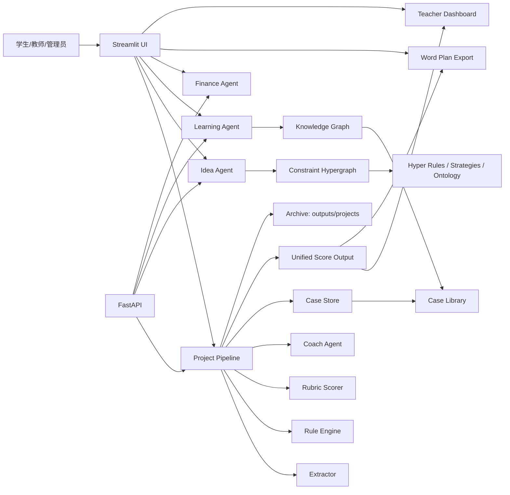

# 创新创业教学智能体项目文档

面向创新创业教学场景的 Streamlit + FastAPI 原型系统。项目当前已经从“单点诊断工具”扩展为一套围绕 `Idea 孵化 -> 项目诊断 -> 学习辅导 -> 财务分析 -> 路演评分 -> 教师干预 -> 项目书导出` 的教学支持链路，并引入了知识图谱、约束超图、统一评分输出与阶段化子图能力。

## 1. 当前项目定位

系统当前服务三类角色：

- 学生端：从粗糙 idea 出发，完成约束追问、项目诊断、学习辅导、财务分析和路演评分。
- 教师端：查看班级聚合看板、阶段分布、薄弱维度、低分热点、单项目证据链与规则状态。
- 管理端：查看 mock 用户、角色分布、项目总量和高风险概况。

系统当前不是一个“自动写完 BP 的生成器”，而是一个受约束的教学智能体：

- 在 A0 阶段先用超图规则和案例上下文约束追问。
- 在 A2-A4 阶段用规则引擎、证据链和 Rubric 做结构化诊断。
- 在 A5/A6 阶段把评分、阶段判断、证据覆盖率和干预建议统一到同一个输出结构。

## 2. 最新整合更新

这份文档已经综合本轮改动和当前工作区里上一轮尚未提交的核心更新，重点包括：

- 新增分阶段体系：`idea -> mvp -> pilot`，并统一到规则、案例、评分和可视化中。
- 新增阶段化知识图谱子图构建：知识图谱支持按案例阶段切子图，并支持“单阶段 / 累计前序阶段”两种模式。
- 新增阶段化超图子图构建：约束超图支持按规则阶段切子图，并支持“单阶段 / 累计前序阶段”两种模式。
- 补强知识图谱可视化节点完整性：不再只看案例数量，还统计子图总节点、渲染节点和节点类型覆盖。
- 新增统一评分输出 `score_summary`：诊断、路演评分、教师看板、Word 计划书导出复用同一套评分摘要。
- 深化教师端看板：新增阶段分布、阶段洞察、低分热点、薄弱维度排行、重点项目排序和统一评分摘要。
- 新增财务分析 Agent：从项目摘要和财务输入计算核心指标，并给出商业化判断。
- 新增 Word 项目计划书导出：可汇总 Idea、诊断、财务、路演评分结果，并支持可选 AI 润色。
- 新增图谱构建脚本：知识图谱和约束图谱都支持 JSON、Cypher 导出，并预留 Neo4j 同步入口。

## 3. 系统能力地图

### A0 Idea 孵化

- 模块：`src/core/idea_agent.py`
- 作用：围绕超图规则做苏格拉底式追问，而不是直接输出完整项目书。
- 关键机制：
  - 根据缺失字段和规则状态选择当前 `focus_rule`
  - 读取约束图谱上下文，补充策略、边类型、修复字段和案例参照
  - 输出结构化 `workspace`、`draft_state`、`generated_project_text`
  - 当核心闭环具备后再把草案交给 A2-A4 诊断

### A1 学习辅导与反代写

- 模块：`src/core/learning_agent.py`
- 作用：回答创业学习问题，同时限制“直接代写 / 可直接提交”的输出。
- 关键机制：
  - 区分 tutor、anti-ghostwriting、emotional redirect 等模式
  - 内置主题库，覆盖 TAM/SAM/SOM、MVP、需求验证、单位经济、渠道、竞争优势、路演表达
  - 可结合知识图谱节点做项目相关回答

### A2-A4 项目诊断主链路

- 模块：`src/core/pipeline.py`
- 数据流：
  - `extractor.py` 提取项目字段
  - `rule_engine.py` 评估 H1-H23 规则
  - `rubric.py` 生成 Rubric 维度评分
  - `coach_agent.py` 生成学生视图、教师视图、debug 视图
  - `retrieval/case_store.py` 拉取案例证据
  - `scoring.py` 生成统一评分输出
- 最终产出：
  - 当前诊断
  - 影响说明
  - 下一步任务
  - 触发规则
  - Rubric 评分
  - `score_summary`
  - markdown 报告
  - 归档记录 `outputs/projects/*.json`

### A5 路演评分

- 入口：`src/ui/streamlit_app.py`
- 作用：根据赛事模板和 Rubric 权重生成加权评分。
- 当前已对齐统一评分输出：
  - 平均分
  - 加权总分
  - 阶段判断
  - 证据覆盖率
  - 逐项修复建议

### A6 教师端看板与干预

- 数据整理：`src/ui/dashboard_data.py`
- 页面入口：`src/ui/streamlit_app.py`
- 当前能力：
  - 班级平均分
  - 高风险项目数
  - Top 规则触发
  - 阶段分布
  - 阶段洞察
  - Rubric 均值
  - 低分热点
  - 薄弱维度排行
  - 项目优先级排序
  - 单项目统一评分摘要、证据覆盖率、规则状态、优势维度与薄弱维度

### 财务分析

- 模块：`src/core/finance_agent.py`
- API：`POST /analysis/finance`
- 当前能力：
  - 计算月收入、毛利率、月净利润、盈亏平衡销量、LTV/CAC、现金跑道等指标
  - 结合项目上下文生成商业化结论、最强信号、最大风险、下一步动作和追问
  - 在 LLM 不可用时提供可回退的规则化分析

### 项目书导出

- 模块：`src/core/plan_export.py`
- 当前能力：
  - 汇总 Idea、诊断、财务、路演评分与追问记录
  - 导出 `.docx`
  - 支持可选 AI 润色
  - 附录区保留原始对话，不做改写

## 4. 核心架构



## 5. 阶段化图谱与超图

### 5.1 阶段定义

- 模块：`src/core/project_stages.py`
- 当前阶段序列：
  - `idea`：问题定义
  - `mvp`：MVP 验证
  - `pilot`：试点落地
- 提供能力：
  - 阶段别名归一化
  - 基于规则推断项目阶段
  - 规则分桶与案例分桶
  - `stage_scope(stage_key, cumulative=True)` 计算阶段范围

### 5.2 分阶段知识图谱子图构建

- 模块：`src/core/knowledge_graph.py`
- 图谱来源：
  - `data/case_library/structured_cases.jsonl`
  - `data/ontology.yaml`
- 当前图谱节点覆盖：
  - Case
  - CaseDomain
  - ProjectField
  - SensitiveDomain
  - CaseOutcome
  - CaseStage
  - CaseTag
  - CaseLesson
  - CaseFailure
  - CaseMetric
- 当前新增能力：
  - `build_stage_knowledge_subgraph(...)`
  - 可按案例阶段切子图
  - 支持累计前序阶段
  - 返回阶段范围、节点类型统计、案例数等信息

### 5.3 分阶段超图子图构建

- 模块：`src/core/constraint_graph.py`
- 图谱来源：
  - `data/hyper_rules`
  - `data/interrogation_strategies.yaml`
  - `data/ontology.yaml`
  - `data/case_library/structured_cases.jsonl`
- 当前新增能力：
  - `build_stage_constraint_subgraph(...)`
  - 可按规则所属阶段切子图
  - 支持累计前序阶段
  - 返回规则数、节点类型统计、阶段范围等信息

### 5.4 可视化层增强

- 模块：`src/ui/visuals.py`
- 知识图谱增强：
  - 支持 `kg_stage_filter`
  - 支持“累计前序阶段”切换
  - 输出 `node_completeness_ratio`
  - 展示当前子图内各类节点的渲染覆盖情况
- 超图增强：
  - 支持 `hyper_stage_filter`
  - 支持“累计前序阶段”切换
  - 展示当前子图、阶段范围、规则数、边元数统计

## 6. 统一评分输出

### 6.1 统一结构

- 模块：`src/core/scoring.py`
- 数据模型：`src/core/models.py`
- 核心输出：`UnifiedScoreOutput`

当前统一评分包含：

- `average_score`
- `weighted_final_score`
- `score_band`
- `stage_key`
- `stage_label`
- `evidence_coverage_ratio`
- `strongest_dimensions`
- `weakest_dimensions`
- `low_score_dimension_count`
- `risk_rule_count`
- `high_risk_rule_count`
- `dimensions`
- `summary`

### 6.2 统一评分已接入的位置

- 诊断主链路：`src/core/pipeline.py`
- 路演评分页面：`src/ui/streamlit_app.py`
- 教师端看板聚合：`src/ui/dashboard_data.py`
- Word 计划书导出：`src/core/plan_export.py`

### 6.3 当前收益

- 不同页面不再各算各的“总分”和“阶段”
- 教师端、路演页、计划书导出可以直接复用同一份评分摘要
- 薄弱维度、证据缺口、24h/72h 修复建议保持一致

## 7. 教师端看板深度

当前教师端不再只停留在“平均分 + 风险项目列表”，而是已经具备以下聚合视角：

- 班级总项目数、平均分、高风险数
- 规则触发 Top N
- 阶段分布
- 阶段洞察
- 统一评分薄弱维度排行
- 低分热点维度
- Rubric 平均分
- 项目优先级排序
- 单项目统一评分摘要
- 单项目证据覆盖率
- 单项目规则状态与修复建议

这部分能力主要落在：

- `src/ui/dashboard_data.py`
- `src/ui/streamlit_app.py`

## 8. 主要目录与模块

### 源码目录

- `src/app/`
  - `main.py`：FastAPI 应用入口
  - `api.py`：对外 API 路由
- `src/core/`
  - `pipeline.py`：A2-A4 项目诊断主链路
  - `idea_agent.py`：A0 Idea 孵化
  - `learning_agent.py`：A1 学习辅导与反代写
  - `finance_agent.py`：财务分析
  - `chat_agent.py`：多轮通用对话
  - `knowledge_graph.py`：知识图谱构建/导出/同步
  - `constraint_graph.py`：约束图谱/超图构建/导出/同步
  - `project_stages.py`：阶段定义与阶段推断
  - `scoring.py`：统一评分输出
  - `plan_export.py`：Word 项目书导出
  - `ocr/`：OCR 与多源材料摄入
  - `retrieval/`：案例检索与向量存储
- `src/ui/`
  - `streamlit_app.py`：前端主入口
  - `dashboard_data.py`：教师端/管理端数据聚合
  - `visuals.py`：评分、规则、KG、超图可视化
  - `auth.py`：mock 登录与角色守卫
  - `asset_precheck.py`：资产规模预检

### 数据与输出目录

- `data/case_library/structured_cases.jsonl`：结构化案例库
- `data/hyper_rules/`：规则定义
- `data/interrogation_strategies.yaml`：追问策略池
- `data/ontology.yaml`：项目字段与敏感域本体
- `outputs/projects/`：项目诊断归档
- `outputs/graphs/`：知识图谱与约束图谱 JSON/Cypher 输出
- `outputs/cases/`：案例索引与结构化 chunk 输出
- `outputs/logs/`：运行日志

### 脚本目录

- `scripts/case_library_manager.py`：案例模板生成、校验、合并、chunk 导出、统计
- `scripts/build_knowledge_graph.py`：构建知识图谱并可选同步 Neo4j
- `scripts/build_constraint_graph.py`：构建约束图谱并可选同步 Neo4j
- `scripts/ingest_case_sources.py` / `scripts/ingest_pdfs.py`：摄入案例材料
- `scripts/build_fifth_iteration_ppt.py`：生成第五次迭代汇报 PPT

## 9. API 概览

当前主要 API 路由如下：

- `POST /chat/project_coach`
- `POST /chat/conversation`
- `POST /chat/idea_coach`
- `POST /chat/learning_tutor`
- `POST /analysis/finance`
- `POST /cases/ingest`
- `GET /dashboard/teacher`

对应文件：`src/app/api.py`

## 10. Mock 登录账号

- 学生端：`student / student123`
- 教师端：`teacher / teacher123`
- 管理端：`admin / admin123`

如果后续接入真实鉴权，优先替换 `src/ui/auth.py` 即可。

## 11. 安装与运行

建议使用 Python 3.11。

### 安装依赖

```powershell
py -3.11 -m pip install -e .[test,ocr,ui]
Copy-Item .env.example .env
```

如果需要 Neo4j 同步能力，可额外安装：

```powershell
py -3.11 -m pip install -e .[graph]
```

### 关键环境变量

```env
DEEPSEEK_API_KEY=sk-xxxx
DEEPSEEK_BASE_URL=https://api.deepseek.com/v1
DEEPSEEK_CHAT_MODEL=deepseek-chat
DEEPSEEK_REASONER_MODEL=deepseek-reasoner
DEEPSEEK_OCR_BASE_URL=http://localhost:8000/v1
DEEPSEEK_OCR_MODEL=deepseek-ai/DeepSeek-OCR
VECTOR_STORE=faiss
CASE_INDEX_DIR=outputs/cases/index
NEO4J_URI=bolt://localhost:7687
NEO4J_USER=neo4j
NEO4J_PASSWORD=neo4j
NEO4J_DATABASE=neo4j
```

### 启动 Streamlit

```powershell
py -3.11 -m streamlit run src/ui/streamlit_app.py
```

### 启动 API

```powershell
py -3.11 -m uvicorn app.main:app --app-dir src --reload
```

## 12. 图谱与案例构建命令

### 构建知识图谱

```powershell
py -3.11 scripts/build_knowledge_graph.py
```

可选同步 Neo4j：

```powershell
py -3.11 scripts/build_knowledge_graph.py --sync-neo4j
```

### 构建约束图谱

```powershell
py -3.11 scripts/build_constraint_graph.py
```

可选同步 Neo4j：

```powershell
py -3.11 scripts/build_constraint_graph.py --sync-neo4j
```

### 案例库工具

```powershell
py -3.11 scripts/case_library_manager.py template --output data/case_library/new_cases_template.jsonl --count 20
py -3.11 scripts/case_library_manager.py validate --input data/case_library/new_cases_template.jsonl --verbose
py -3.11 scripts/case_library_manager.py append --input data/case_library/new_cases_template.jsonl --target data/case_library/structured_cases.jsonl
py -3.11 scripts/case_library_manager.py export-chunks --input data/case_library/structured_cases.jsonl --output outputs/cases/structured_chunks.jsonl
py -3.11 scripts/case_library_manager.py stats --input data/case_library/structured_cases.jsonl
```

## 13. 资产规模预检

功能中心提供资产预检页，当前检查的硬性下限包括：

- Rubric 维度数量 `>= 10`
- 赛事模板数量 `>= 4`
- KG 节点数量 `>= 100`
- 结构化案例数量 `>= 50`
- 超边数量 `>= 20`
- 规则诊断池数量 `>= 20`
- 追问策略池数量 `>= 15`

对应文件：`src/ui/asset_precheck.py`

## 14. 测试

### 运行全部测试

```powershell
py -3.11 -m pytest
```

### 本轮已重点回归的测试

```powershell
pytest tests/test_stage_subgraphs.py tests/test_pipeline_smoke.py tests/test_plan_export.py tests/test_hypergraph_visuals.py tests/test_knowledge_graph.py -q
```

结果：`13 passed`

当前测试目录已经覆盖以下方向：

- 规则与超图
- 阶段子图
- 管线 smoke test
- 计划书导出
- 财务 Agent
- OCR ingest
- UI 鉴权
- 资产预检

## 15. 当前状态总结

项目当前已经形成下面这条完整主线：

1. A0 用约束图谱和规则驱动追问，帮助学生把 idea 收束成项目草案。
2. A2-A4 用规则、证据、案例和 Rubric 产出结构化诊断。
3. A5 用统一评分输出生成路演评分与逐项修复建议。
4. A6 把单项目结果汇总成教师端班级看板和干预洞察。
5. 财务分析与 Word 项目书导出作为结果汇总层补上商业化与正式材料输出。

如果要继续往下一阶段推进，优先建议放在三件事上：

- 扩充真实高质量案例库，提升阶段子图和案例检索的密度。
- 继续深化教师端，从“看分”走向“可配置干预动作”。
- 把 Neo4j 同步能力真正接上真实图库环境，验证图检索和图可视化链路。
